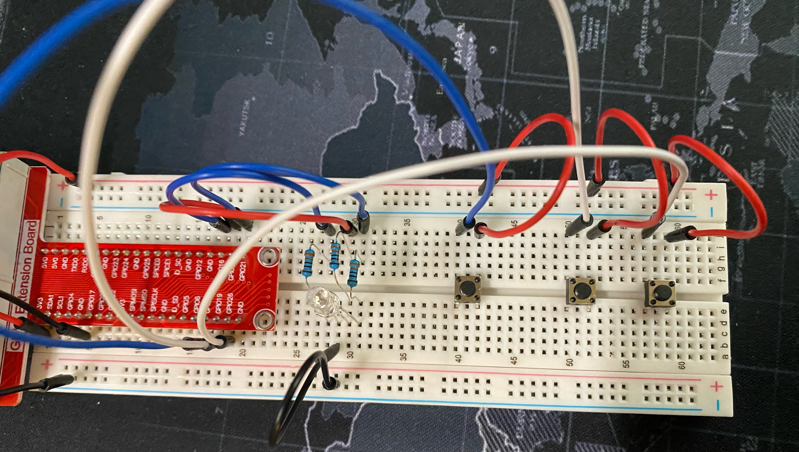
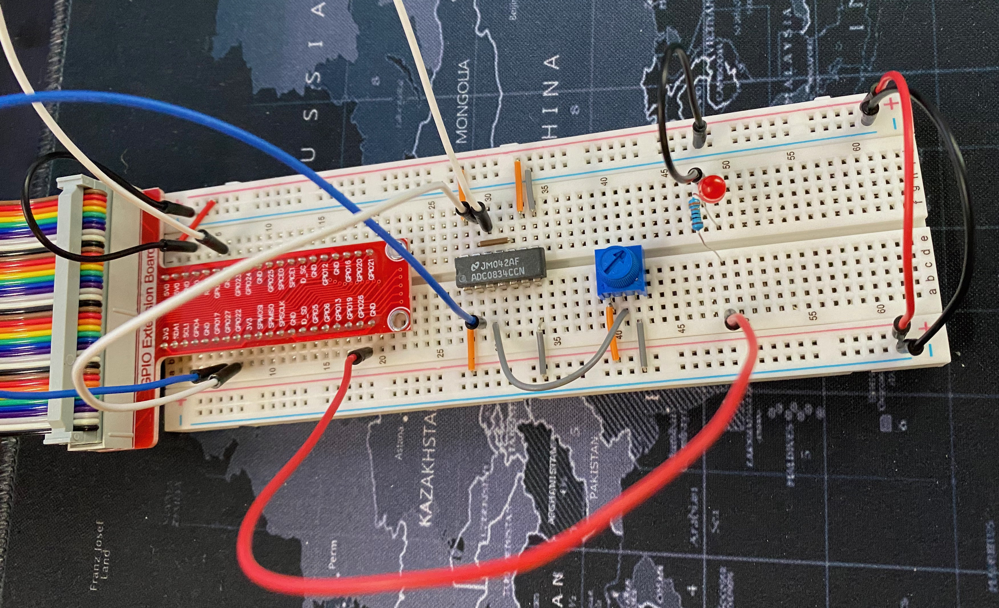
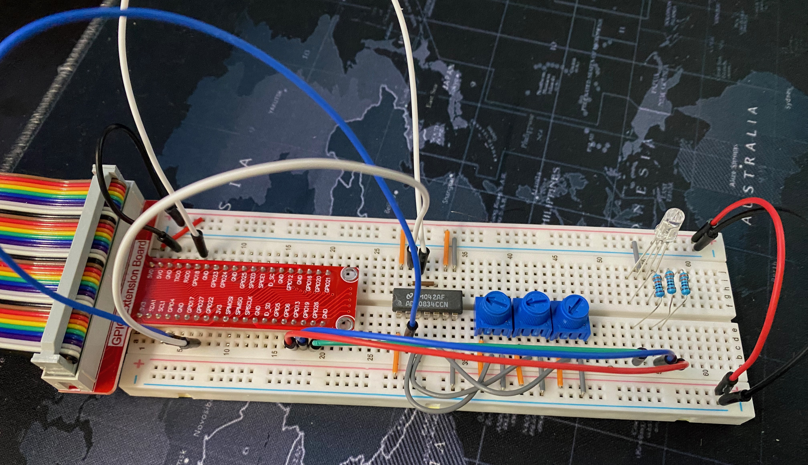
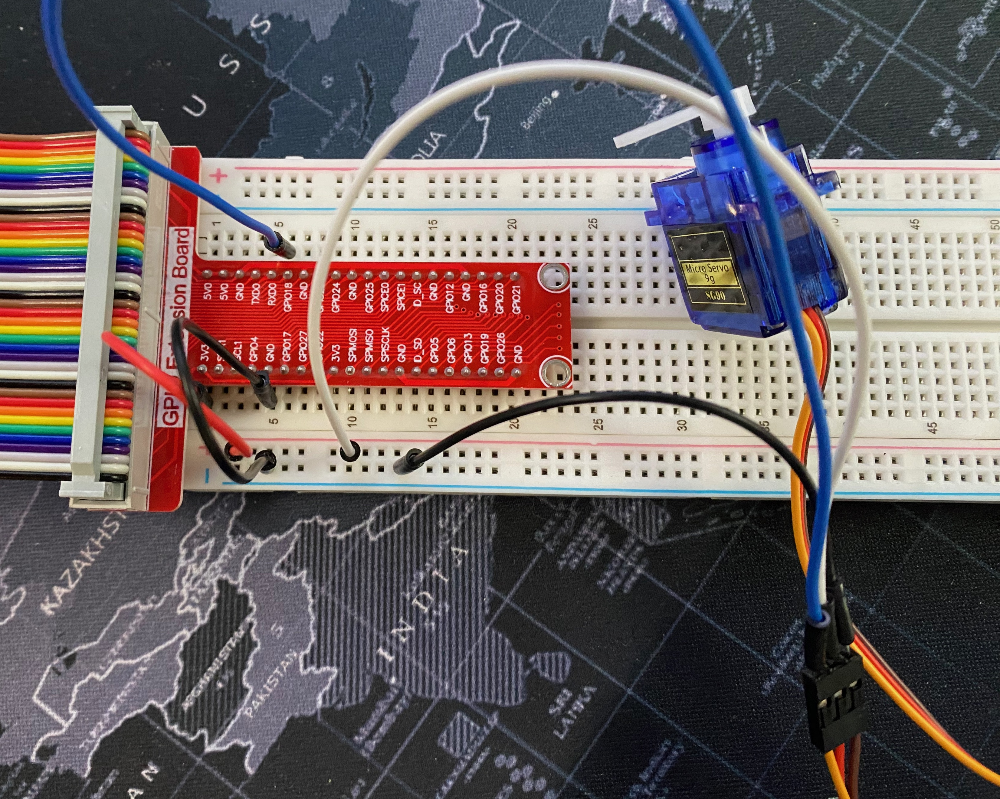
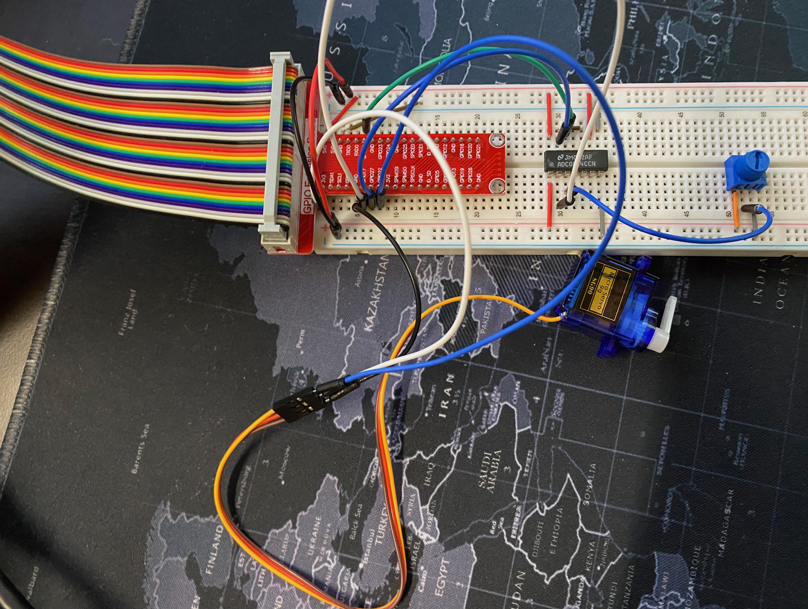
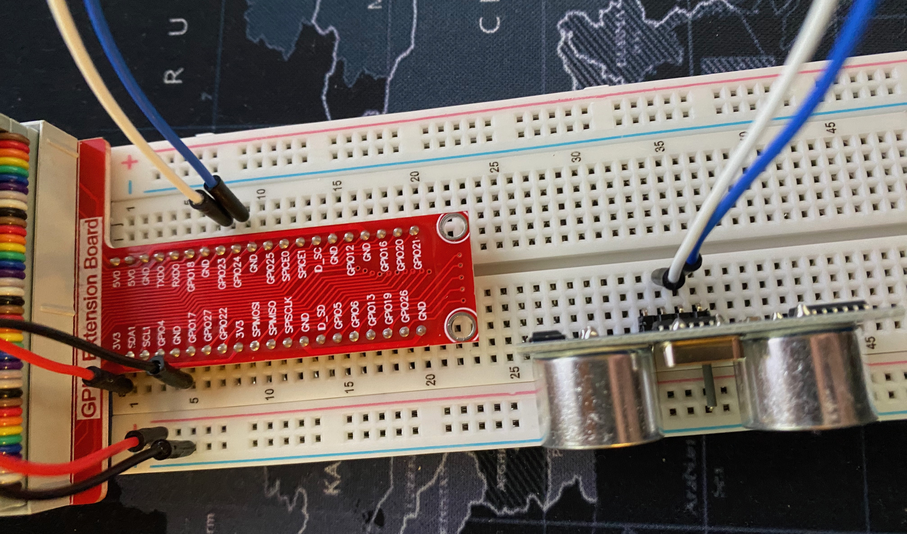
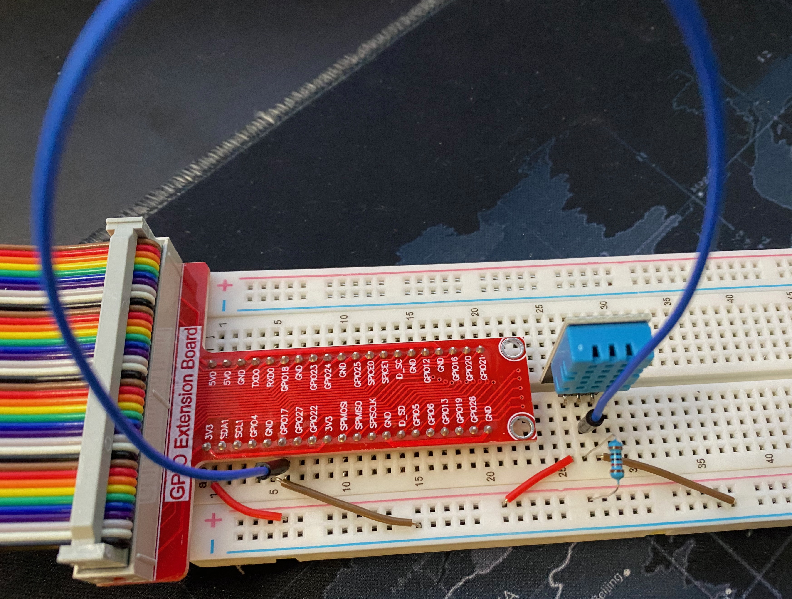
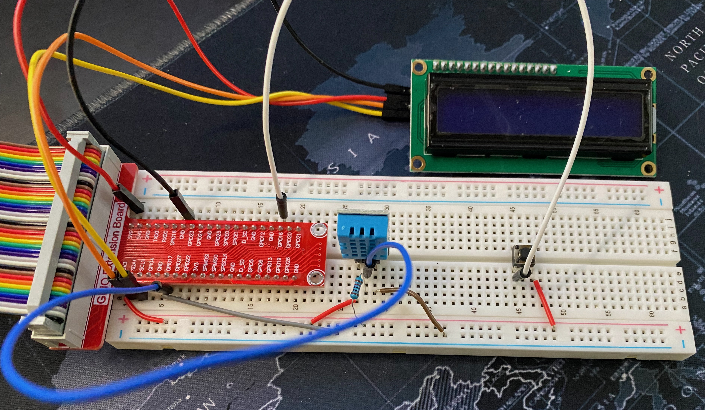
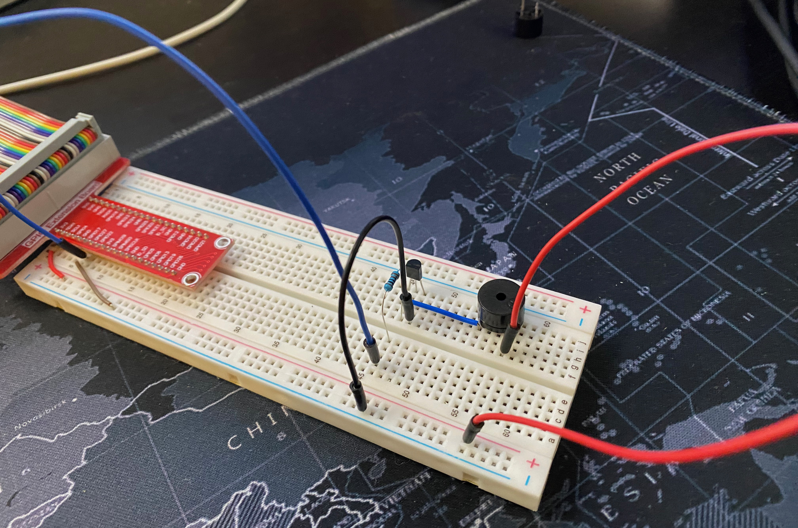
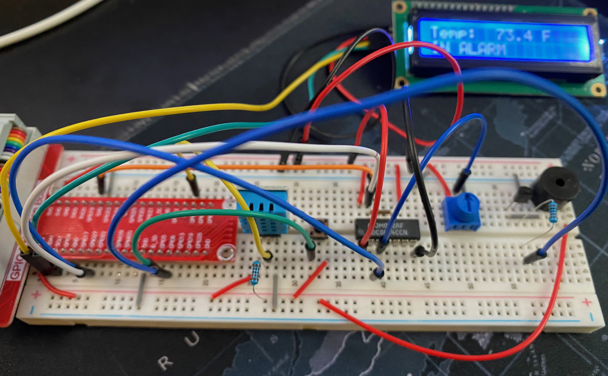

# RPi GPIO Experiments

## LED Brightness Toggle

A simple, two-button LED brightness toggle using PWM.

[The code](led_brightness_toggle.py)

The circuit:

## RGB LED Toggle

3-button RGB LED toggle.

[The code](rgb_led_toggle.py)

The circuit:

## RGB LED Variable Brightness

3-button RGB LED toggle, but where each color of the RGB LED increments exponentially, rather than simply turning on/off.

[The code](rgb_led_variable_toggle.py)

The circuit in this case is identical to [RGB LED Toggle](#rgb-led-toggle).

## Analog Input - Single LED

Analog input with ADC0834 analog-to-digital converter, used to control the brightness of an LED.

[The code](analog_input.py)

The circuit:

## Analog Input - RGB LED

Analog input with ADC0834 analog-to-digital converter, used to control the brightness of a the three components of an RGB LED.

[The code](analog_input_rgb_led.py)

The circuit:

## Servo Control From User Input via PWM

Control a servo using PWM given a user-supplied percentage.

[The code](pwm_servo.py)

The circuit:

## Servo Control Using Potentiometer via PWM

Control a servo using PWM given a potentiometer reading.

[The code](pwm_servo_potentiometer.py)

The circuit:

## Ultrasonic Sensor

Use an ultrasonic sensor to measure the distance of an object in inches.

[The code](ultrasonic_sensor.py)

The circuit:

## Temperature / Humidity Detector

Display the current temperature and humidity.

[The code](temp_humidity_detector.py)

The circuit:

## LCD Temperature / Humidity Display

Display the current temperature and humidity with a button to toggle between Celcius and Fahrenheit.

[The code](lcd_temperature_display.py)

The circuit:

## Buzzers - Active and Passive

Make buzzers make sounds.

[Active buzzer code](active_buzzer.py)

[Passive buzzer code](passive_buzzer.py)

The circuit (identical for both active/passive, except for the type of buzzer used):

## Temperature Sensor With Configurable Alarm

Temperature sensor with configurable temperature that - if exceeded - will cause a buzzer to sound.

[The code](temperature_sensing_alarm.py)

The circuit:

## Photoresistor

Photoresistor experiments.

[Basic photoresistor test](photoresistor.py)
[Photoresistor / motion detector alarm](photoresistor_motion_detector.py)