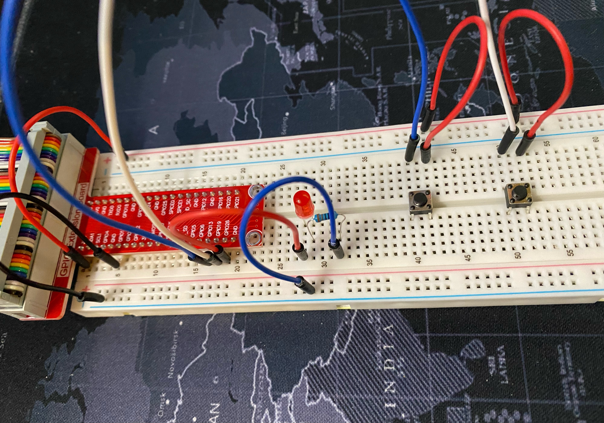

# RPi GPIO Experiments

## LED Brightness Toggle

A simple, two-button LED brightness toggle using PWM.

[The code](led_brightness_toggle.py)

The circuit:

## RGB LED Toggle

3-button RGB LED toggle.

[The code](rgb_led_toggle.py)

The circuit:
